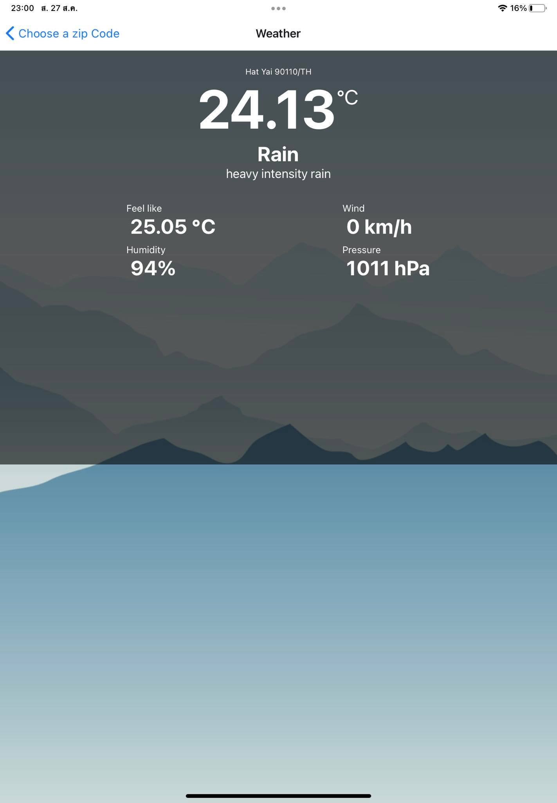
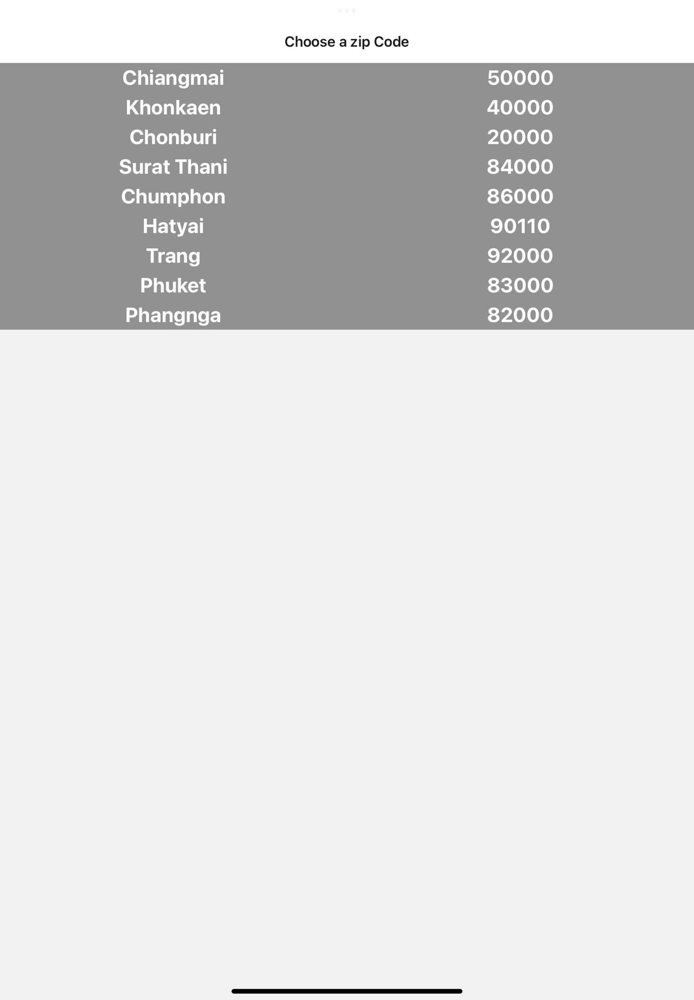
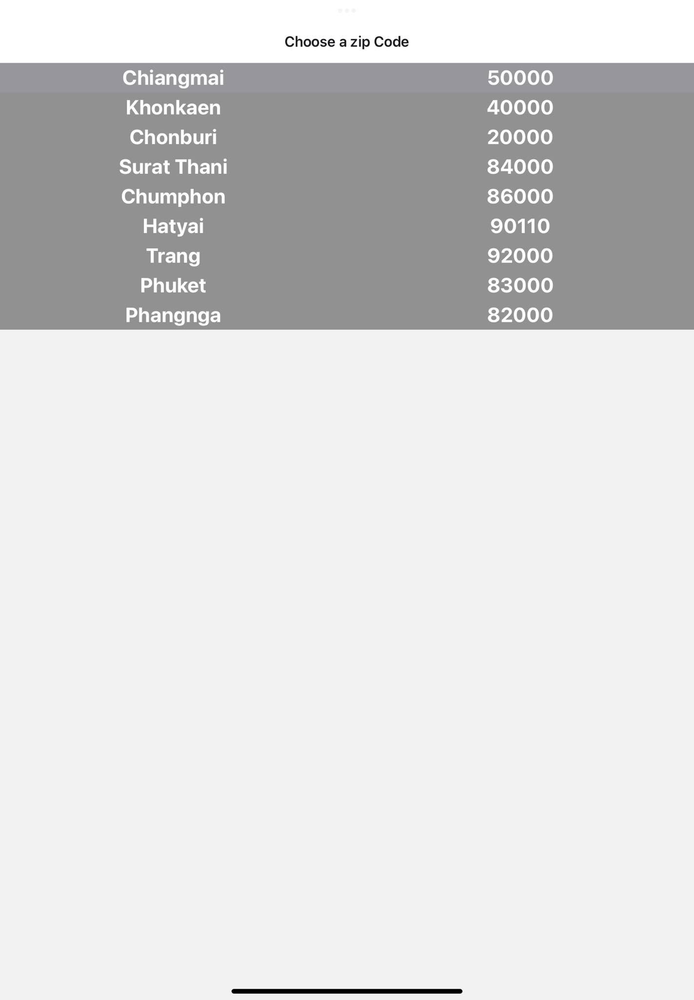
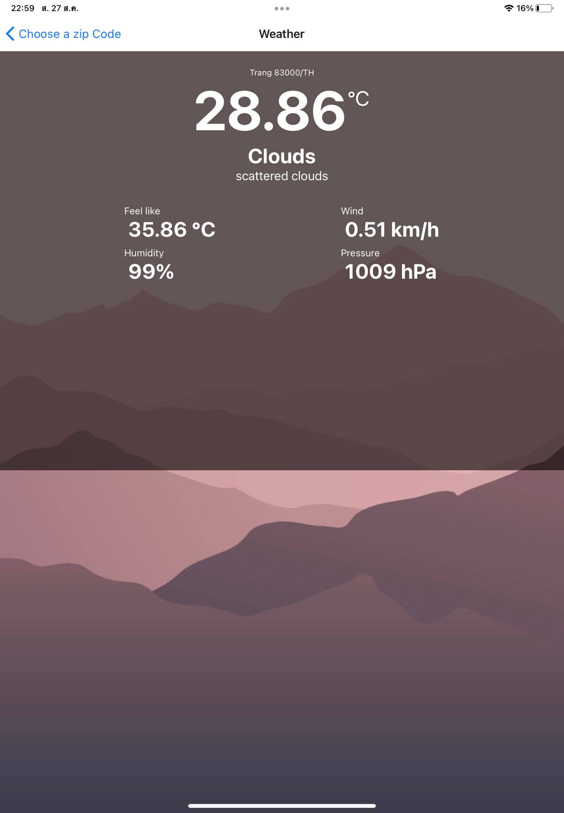

lab3SA03-React
ชื่อ-สกุล: ธีรภัทร คงชู
รหัสนักศึกษา: 6310101219
section: 01
------------------------------------------
สรุปสิ่งที่ทำ
  -แก้ไขข้อความแต่ละหน้าให้เป็น Weather และ Choose a zip code
  -ปรับแต่งการจัดวางในหน้า Weather ให้ดูง่ายขึ้น
  -เพิ่มการอ่านค่า humidity, feels_like, pressure, wind_speed ที่นำมาจาก api openweathermap 
  -ปรับแต่งการจัดวางในหน้า Choose a zip code ให้ดูง่ายขึ้น
  -เพิ่มจัดหวัด รหัสไปรษณีย์ และเปลี่ยนสีการแตะปุ่มตอนที่จะเลือกจัดหวัด รหัสไปรษณีย์ ในหน้า Choose a zip code
  -เปลี่ยนรูปพื้นหลังตามอุณหภูมิความร้อนของแต่ละที่
 ------------------------------------------
 รายละเอียด
 
 
 
 มีการจัดเรียงปรับแต่งการจัดวางในหน้า Weather ให้ดูง่ายขึ้น โดยจะมีการแก้ไขโค้ดในส่วนของ file Forecast.js และ Weather.js เป็นหลัก 
 โดยจะใช้ StyleSheet ในการปรับการจัดวาง การปรับแต่งขนาดตัวอักษร ตำแหน่งต่างๆ 
 ใน Weather.js จะปรับแต่งในส่วนของ ข้อความแสดง จังหวัด รหัสไปรษณีย์ ประเทศ
 ใน Forecast.js จะปรับแต่งในส่วนของ อุณหภูมิ main description และ พวก humidity, feels_like, pressure, wind_speed ที่เพิ่มมาภายหลัง
 
  ------------------------------------------
  
 
 -----------
 เมื่อแตะปุ่มสีเปลี่ยน
  
  
 มีการจัดเรียงปรับแต่งการจัดวางในหน้า Choose a zip code ให้ดูง่ายขึ้น ซึ่งจะทำการปรับแต่งในไฟล์ ZipCodeScreen.js
 โดยใช้ StyleSheet ในการปรับการจัดวาง การปรับแต่งขนาดตัวอักษร ตำแหน่งต่างๆ ความเข้มสีพิ่นหลัง
 อีกทั้งยังปรับการแตะที่ปุ่มของ TouchableHighlight ให้เป็นสีที่ต้องการได้ โดยเพอ่มคำสั่ง underlayColor="" เข้าไป
 และ มีการเพิ่มจัดหวัด รหัสไปรษณีย์ โดยสามารถเพิ่มที่ส่วนของ availableZipItems ของไฟล์ ZipCodeScreen.js
  ------------------------------------------
  
 
 
 อุณหภูมิ > 28
 
 
  อุณหภูมิ < 28
 
 
การเปลี่ยนรูป background ตามอุณหภูมิ 
ทำได้โดยการเพิ่มใส่เงื่อนไข source={forecastInfo.temp < 28 ? require('../bg_cool.jpg') : require('../bg_hot.jpg')} ในส่วนของ การ return ImageBackground
 ในไฟล์ Weather.js โดยมีเงื่อนไขคือ ถ้า อุณหภูมิใน zipcode นั้น ๆ มากกว่า 28 ก็จะหใ้ใช้ background สีโทนร้อน ถ้าน้อยกกว่าก็ใช้ สีโทนเย็น
  
